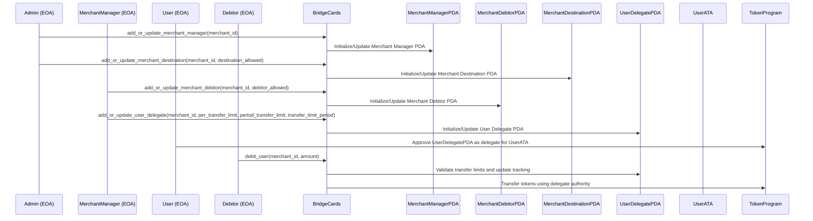

# Bridge Cards Program

## Overview

The Bridge Cards program is a Solana-based payment delegation system that enables secure, controlled token transfers between users and merchants. It implements a hierarchical permission model with multiple participant roles and safety controls.

### Key Participants

- **Admin**: Controls merchant manager permissions and destination accounts
- **Merchant Manager**: Manages debitor permissions and user delegate settings for a specific merchant
- **Debitor**: Entity authorized to initiate debits on behalf of a merchant
- **User**: Token holder who grants spending permissions to token-and-merchant-specific delegate PDAs

### Core Features

- **Delegated Payments**: Users can pre-approve merchants to debit their accounts within specified limits
- **Spending Controls**: Configurable per-transaction and time-period spending limits
- **Hierarchical Permissions**: Multi-level authorization system for merchant operations
- **Destination Management**: Controlled merchant token destination accounts

### Security Model

The program uses Program Derived Addresses (PDAs) to maintain secure state and enforce permissions:

- **MerchantManagerPDA**: Tracks authorized managers for each merchant
- **MerchantDebitorPDA**: Controls which addresses can initiate debits
- **MerchantDestinationPDA**: Manages approved token destination accounts
- **UserDelegatePDA**: Stores and enforces user-specified spending limits

### Transaction Flow

1. Admin sets up merchant infrastructure
2. Merchant managers configure debitors and delegate parameters
3. Users approve delegate PDAs to spend from their token accounts
4. Authorized debitors initiate transfers within configured limits

The program ensures all operations respect the established permission hierarchy and spending limits.

## Dependencies

- Anchor `0.31.0`
- Solana `2.1.18`

## Deployments

_This program is currently deployed to the following networks and accounts_

| Network        | Account                                                                                                                                         |
| -------------- | ----------------------------------------------------------------------------------------------------------------------------------------------- |
| Devnet         | [`cardWArqhdV5jeRXXjUti7cHAa4mj41Nj3Apc6RPZH2`](https://explorer.solana.com/address/cardWArqhdV5jeRXXjUti7cHAa4mj41Nj3Apc6RPZH2?cluster=devnet) |
| Mainnet (beta) | [`cardWArqhdV5jeRXXjUti7cHAa4mj41Nj3Apc6RPZH2`](https://explorer.solana.com/address/cardWArqhdV5jeRXXjUti7cHAa4mj41Nj3Apc6RPZH2)                |

## Flow Diagram


## Sequence Diagram



## State Diagram


## Example Client

Interacting with the `bridge-card-program` is very straightforward, and can be done via a single instruction to approve a delegate. All other interactions will be administerd by Bridge.

```typescript
import {
  Connection,
  Keypair,
  PublicKey,
  Transaction,
  sendAndConfirmTransaction,
  clusterApiUrl,
  LAMPORTS_PER_SOL,
} from "@solana/web3.js";
import {
  TOKEN_PROGRAM_ID,
  createApproveInstruction,
  getAssociatedTokenAddressSync,
} from "@solana/spl-token";
import { Buffer } from "buffer";
import { BN } from "@coral-xyz/anchor";

class BridgeSDK {
  public static readonly USER_DELEGATE_SEED = Buffer.from("user_delegate");
  constructor(private readonly programId: PublicKey) {}

  private formatAnchorNumber(number: BN): Buffer {
    return number.toArrayLike(Buffer, "le", 8);
  }

  findUserDelegatePDA(
    merchantId: BN,
    mintPubkey: PublicKey,
    userAta: PublicKey
  ): [PublicKey, number] {
    return PublicKey.findProgramAddressSync(
      [
        BridgeSDK.USER_DELEGATE_SEED,
        this.formatAnchorNumber(merchantId),
        mintPubkey.toBuffer(),
        userAta.toBuffer(),
      ],
      this.programId
    );
  }
}

const PROGRAM_ID = new PublicKey("cardWArqhdV5jeRXXjUti7cHAa4mj41Nj3Apc6RPZH2");

// USDC MINT
const MINT_PUBKEY = new PublicKey(
  "Gh9ZwEmdLJ8DscKNTkTqPbNwLNNBjuSzaG9Vp2KGtKJr"
);

// Merchant ID -- this will be given to you by Bridge.
const MERCHANT_ID = new BN(1);

const MINT_DECIMALS = 6;
const APPROVAL_AMOUNT_UI = 100;
const APPROVAL_AMOUNT = BigInt(APPROVAL_AMOUNT_UI * 10 ** MINT_DECIMALS);

const connection = new Connection(clusterApiUrl("devnet"), "confirmed");

async function approveDelegate() {
  // Sample keypair
  const userKeypair = Keypair.generate();

  // Get the user's token account for the given currency.
  const userAta = getAssociatedTokenAddressSync(
    MINT_PUBKEY,
    userKeypair.publicKey
  );

  const bridgeSdk = new BridgeSDK(PROGRAM_ID);
  const [delegatePda] = bridgeSdk.findUserDelegatePDA(
    MERCHANT_ID,
    MINT_PUBKEY,
    userAta
  );

  // Approve the BridgeCard contract to manage the user's token account.
  const approveInstruction = createApproveInstruction(
    userAta,
    delegatePda,
    userKeypair.publicKey,
    APPROVAL_AMOUNT,
    [],
    TOKEN_PROGRAM_ID
  );

  const transaction = new Transaction().add(approveInstruction);

  // You could optionally pay these fees on behalf of your users.
  transaction.feePayer = userKeypair.publicKey;

  const signature = await sendAndConfirmTransaction(CONNECTION, transaction, [
    userKeypair,
  ]);
}

approveDelegate();
```

## Audits

Bridge Cards was audited by [Zenith](https://zenith.security). You can find the report [here](/audits/Bridge-Cards-Zenith-Audit-Report.pdf).
