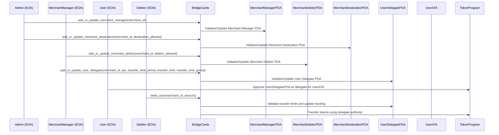

# Bridge Cards Program

## Overview

The Bridge Cards Program is a Solana-based payment system that enables secure, pull-based token transfers between users and merchants.

This program was designed to power the [Bridge Cards](https://www.bridge.xyz/product/cards) product.

### How It Works

The system allows users to grant spending permissions to merchants through a secure delegation mechanism:

1. **Setup**: Merchants register with the system and configure their payment parameters.
2. **User Approval**: Users approve specific spending limits for each merchant they want to transact with.
3. **Automated Payments**: Merchants can then charge users automatically within the approved limits.

### Key Benefits

- **Seamless Payments**: Enable recurring payments without requiring user signatures for each transaction.
- **Granular Control**: Adminsters can set per-transaction and time-period spending limits for each merchant/user pair.
- **Enhanced Security**: Multi-level permission system with admin oversight and merchant controls.

## Deployments

| Network        | Account                                                                                                                                         |
| -------------- | ----------------------------------------------------------------------------------------------------------------------------------------------- |
| Mainnet (beta) | [`cardWArqhdV5jeRXXjUti7cHAa4mj41Nj3Apc6RPZH2`](https://explorer.solana.com/address/cardWArqhdV5jeRXXjUti7cHAa4mj41Nj3Apc6RPZH2)                |
| Devnet         | [`cardWArqhdV5jeRXXjUti7cHAa4mj41Nj3Apc6RPZH2`](https://explorer.solana.com/address/cardWArqhdV5jeRXXjUti7cHAa4mj41Nj3Apc6RPZH2?cluster=devnet) |

## Audits

Bridge Cards was audited by [Zenith](https://zenith.security). You can find the report [here](/audits/Bridge-Cards-Zenith-Audit-Report.pdf).

---

# Developer Documentation

## Architecture Overview

The Bridge Cards program implements a hierarchical permission model with multiple participant roles and safety controls.

### Participant Roles

- **Admin**: Controls merchant manager permissions and destination accounts
- **Merchant Manager**: Manages debitor permissions and user delegate settings for a specific merchant
- **Debitor**: Entity authorized to initiate debits on behalf of a merchant
- **User**: Token holder who grants spending permissions to token-and-merchant-specific delegate PDAs

### Program Derived Addresses (PDAs)

The program uses PDAs to maintain secure state and enforce permissions:

- `MerchantManagerPDA`: Tracks authorized managers for each merchant
- `MerchantDebitorPDA`: Controls which addresses can initiate debits
- `MerchantDestinationPDA`: Manages approved token destination accounts
- `UserDelegatePDA`: Stores and enforces user-specified spending limits

### Transaction Flow

1. Admin sets up merchant infrastructure
2. Merchant managers configure debitors and delegate parameters
3. Users approve delegate PDAs to spend from their token accounts
4. Authorized debitors initiate transfers within configured limits

## Flow Diagram


## Sequence Diagram



## State Diagram

```mermaid
classDiagram
class BridgeCardsState PDA {
    <<b"state">>
    +admin: Pubkey
    +bump: u8
    +initialize()
    +add_or_update_merchant_manager(merchant_id: u64)
    +add_or_update_merchant_destination(merchant_id: u64, destination_allowed: bool)
    +add_or_update_merchant_debitor(merchant_id: u64, debitor_allowed: bool)
    +add_or_update_user_delegate(merchant_id: u64, per_transfer_limit: u64, period_transfer_limit: u64, transfer_limit_period: u32)
    +debit_user(merchant_id: u64, amount: u64)
    +update_admin()
    +close_account(input_seeds: Vec<Vec<u8>>)
}

class MerchantManagerState PDA {
    <<b"merchant_manager", merchant_id>>
    +manager: Pubkey
    +bump: u8
}

class MerchantDebitorState PDA {
    <<b"merchant_debitor", merchant_id, mint, debitor>>
    +allowed: bool
    +bump: u8
}

class MerchantDestinationState PDA {
    <<b"merchant_destination", merchant_id, mint, destination_token_account>>
    +allowed: bool
    +bump: u8
}

class UserDelegateState PDA {
    <<b"user_delegate", merchant_id, mint, user_token_account>>
    +per_transfer_limit: u64
    +period_transfer_limit: u64
    +period_transferred_amount: u64
    +period_timestamp_last_reset: u64
    +transfer_limit_period_seconds: u32
    +slot_last_transferred: u64
    +bump: u8
    +validate_debit_and_update(amount: u64, current_time: u64, current_slot: u64)
}
```



## Client Integration

Interacting with the program is very straightforward, and can be done via a single instruction to approve a delegate. All other interactions will be administered by Bridge.

### Typescript

```typescript
import {
  Connection,
  Keypair,
  PublicKey,
  Transaction,
  sendAndConfirmTransaction,
  clusterApiUrl,
  LAMPORTS_PER_SOL,
} from "@solana/web3.js";
import {
  TOKEN_PROGRAM_ID,
  createApproveInstruction,
  getAssociatedTokenAddressSync,
} from "@solana/spl-token";
import { Buffer } from "buffer";
import { BN } from "@coral-xyz/anchor";

class BridgeSDK {
  public static readonly USER_DELEGATE_SEED = Buffer.from("user_delegate");
  constructor(private readonly programId: PublicKey) {}

  private formatAnchorNumber(number: BN): Buffer {
    return number.toArrayLike(Buffer, "le", 8);
  }

  findUserDelegatePDA(
    merchantId: BN,
    mintPubkey: PublicKey,
    userAta: PublicKey
  ): [PublicKey, number] {
    return PublicKey.findProgramAddressSync(
      [
        BridgeSDK.USER_DELEGATE_SEED,
        this.formatAnchorNumber(merchantId),
        mintPubkey.toBuffer(),
        userAta.toBuffer(),
      ],
      this.programId
    );
  }
}

const PROGRAM_ID = new PublicKey("cardWArqhdV5jeRXXjUti7cHAa4mj41Nj3Apc6RPZH2");

// USDC MINT
const MINT_PUBKEY = new PublicKey(
  "Gh9ZwEmdLJ8DscKNTkTqPbNwLNNBjuSzaG9Vp2KGtKJr"
);

// Merchant ID -- this will be given to you by Bridge.
const MERCHANT_ID = new BN(1);

const MINT_DECIMALS = 6;
const APPROVAL_AMOUNT_UI = 100;
const APPROVAL_AMOUNT = BigInt(APPROVAL_AMOUNT_UI * 10 ** MINT_DECIMALS);

const connection = new Connection(clusterApiUrl("devnet"), "confirmed");

async function approveDelegate() {
  // Sample keypair
  const userKeypair = Keypair.generate();

  // Get the user's token account for the given currency.
  const userAta = getAssociatedTokenAddressSync(
    MINT_PUBKEY,
    userKeypair.publicKey
  );

  const bridgeSdk = new BridgeSDK(PROGRAM_ID);
  const [delegatePda] = bridgeSdk.findUserDelegatePDA(
    MERCHANT_ID,
    MINT_PUBKEY,
    userAta
  );

  // Approve the BridgeCard contract to manage the user's token account.
  const approveInstruction = createApproveInstruction(
    userAta,
    delegatePda,
    userKeypair.publicKey,
    APPROVAL_AMOUNT,
    [],
    TOKEN_PROGRAM_ID
  );

  const transaction = new Transaction().add(approveInstruction);

  // You could optionally pay these fees on behalf of your users.
  transaction.feePayer = userKeypair.publicKey;

  const signature = await sendAndConfirmTransaction(CONNECTION, transaction, [
    userKeypair,
  ]);
}

approveDelegate();
```

### Rust

```rust
use solana_sdk::{
    pubkey::Pubkey,
    signature::Keypair,
    transaction::Transaction,
};
use solana_client::rpc_client::RpcClient;
use spl_token::instruction::approve;
use std::str::FromStr;

struct BridgeSDK {
    program_id: Pubkey,
}

impl BridgeSDK {
    const USER_DELEGATE_SEED: &'static [u8] = b"user_delegate";

    pub fn new(program_id: Pubkey) -> Self {
        Self { program_id }
    }

    pub fn find_user_delegate_pda(
        &self,
        merchant_id: u64,
        mint_pubkey: &Pubkey,
        user_ata: &Pubkey,
    ) -> (Pubkey, u8) {
        Pubkey::find_program_address(
            &[
                Self::USER_DELEGATE_SEED,
                &merchant_id.to_le_bytes(),
                mint_pubkey.as_ref(),
                user_ata.as_ref(),
            ],
            &self.program_id,
        )
    }
}

fn main() -> Result<(), Box<dyn std::error::Error>> {
    let program_id = Pubkey::from_str("cardWArqhdV5jeRXXjUti7cHAa4mj41Nj3Apc6RPZH2")?;

    // USDC MINT
    let mint_pubkey = Pubkey::from_str("Gh9ZwEmdLJ8DscKNTkTqPbNwLNNBjuSzaG9Vp2KGtKJr")?;

    // Merchant ID -- this will be given to you by Bridge
    let merchant_id: u64 = 1;

    let mint_decimals = 6;
    let approval_amount_ui = 100u64;
    let approval_amount = approval_amount_ui * 10u64.pow(mint_decimals);

    // Sample keypair
    let user_keypair = Keypair::new();

    // Get the user's associated token account for the given currency
    let user_ata = spl_associated_token_account::get_associated_token_address(
        &user_keypair.pubkey(),
        &mint_pubkey,
    );

    let bridge_sdk = BridgeSDK::new(program_id);
    let (delegate_pda, _bump) = bridge_sdk.find_user_delegate_pda(
        merchant_id,
        &mint_pubkey,
        &user_ata,
    );

    // Create RPC client
    let rpc_client = RpcClient::new("https://api.devnet.solana.com".to_string());

    // Create approve instruction
    let approve_instruction = approve(
        &spl_token::ID,
        &user_ata,
        &delegate_pda,
        &user_keypair.pubkey(),
        &[],
        approval_amount,
    )?;

    // Build and send transaction
    let transaction = Transaction::new_signed_with_payer(
        &[approve_instruction],
        Some(&user_keypair.pubkey()),
        &[&user_keypair],
        rpc_client.get_latest_blockhash()?,
    );

    let signature = rpc_client.send_and_confirm_transaction(&transaction)?;
    println!("Transaction signature: {}", signature);

    Ok(())
}
```

## Audits

Bridge Cards was audited by [Zenith](https://zenith.security). You can find the report [here](/audits/Bridge-Cards-Zenith-Audit-Report.pdf).
